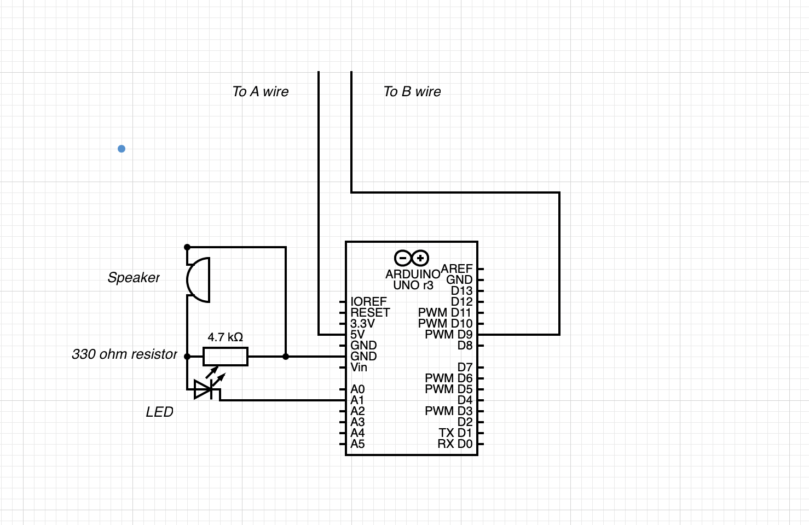

# Bluetooth-Fencing-Scoring-System

Suggested materials for 1 box:

  1. [Adafruit ESP32](https://www.adafruit.com/product/3269) - $15
  2. [Solderable breadboard](https://www.adafruit.com/product/1609) - $5
  3. [Piezo buzzer](https://www.adafruit.com/product/160) - $1.50
  4. [5mm LED](https://www.adafruit.com/product/4203) - $5
  5. 330 ohm resistor
  6. [German epee socket](https://www.absolutefencinggear.com/af-master-series-german-epee-socket.html) - $11
  7. Solder/Soldering iron

Total is about $40

## Building the circuit:

1. Place ESP32 board into breadboard with usb connector at the edge, solder header pins to breadboard
2. Wire positive pin of LED to pin A1, or GPIO pin 25 ([pinout found here](https://cdn-shop.adafruit.com/product-files/3269/pinout_wroom_pinout.png))
3. Wire negative pin of LED to positive speaker pin and 330 ohm resistor, negative speaker pin and resistor should end at ground.
4. Wire 5v out pin on board to A line in the epee socket, Wire b line in socket to D9 pin on board

Done, you breadboard should now look roughly like this(but hopefully better):

## Building the program:
1. Go to tools and set board to ESP32 dev module, set port to the port where you board is plugged in.
2. We first must find the MAC address of the ESP32 board, using the included get_mac.ino program. The MAC address will be output to the serial monitor, you must manually convert it to the correct format seen in Fencer1.ino and Fencer2.ino (0xYY where YY is the corresponding 2 characters found).
3. Set uint8_t broadcastAddress at line 27 in Fencer1.ino to the found MAC address of the board you are using for Fencer2.ino and set uint8_t broadcastAddress at line 27 in Fencer2.ino to the MAC address of the board for Fencer1.ino
4. Download Fencer1.ino and Fencer2.ino to there respective boards. Use body cord to connect to weapon and test.
